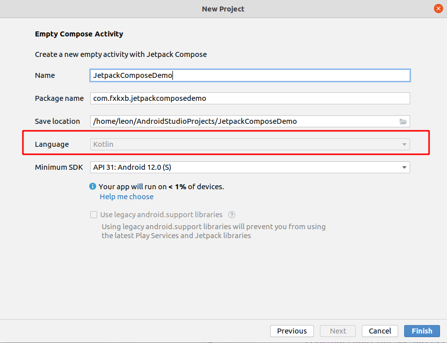
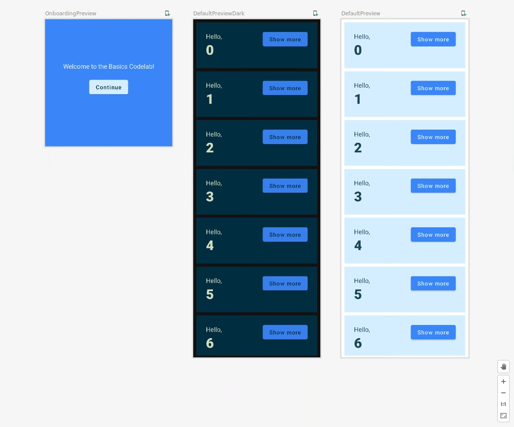

# [Jetpack Compose basics](https://developer.android.com/codelabs/jetpack-compose-basics)

[Jetpack Compose 教程](https://developer.android.com/jetpack/compose/tutorial?hl=zh-cn)

## Before you begin

Jetpack Compose是一个声明式的结合了反应式编程模型和 Kotlin 编程语言的简洁性和易用性的现代化工具包，旨在简化 UI 开发。

Compose 应用程序由可composable函数组成 - 只是标有@Composable的常规函数，可以调用其他可组合函数。创建新的 UI 组件只需要一个函数。注释告诉 Compose 为随着时间的推移更新和维护 UI 的功能添加特殊支持。Compose 可让您将代码组织成小块。可组合函数通常简称为“composables”。

通过制作小型的可重用组合，可以轻松构建应用程序中使用的 UI 元素库。每个人负责屏幕的一部分，可以独立编辑。

您将构建一个带有登录屏幕和动画扩展项列表的应用程序：


## Starting a new Compose project

打开Android Studio Arctic Fox新建空Compose Activity。


> API Compose支持的最小SDK版本是API 21

Jetpack Compose使用了大量Kotlin特性和API，只能用Kotlin开发。



JetpackComposeDemo

```kotlin
package com.fxkxb.jetpackcomposedemo

import android.os.Bundle
import androidx.activity.ComponentActivity
import androidx.activity.compose.setContent
import androidx.compose.material.MaterialTheme
import androidx.compose.material.Surface
import androidx.compose.material.Text
import androidx.compose.runtime.Composable
import androidx.compose.ui.tooling.preview.Preview
import com.fxkxb.jetpackcomposedemo.ui.theme.JetpackComposeDemoTheme

class MainActivity : ComponentActivity() {
    override fun onCreate(savedInstanceState: Bundle?) {
        super.onCreate(savedInstanceState)
        setContent {
            JetpackComposeDemoTheme {
                // A surface container using the 'background' color from the theme
                Surface(color = MaterialTheme.colors.background) {
                    Greeting("Android")
                }
            }
        }
    }
}

@Composable
fun Greeting(name: String) {
    Text(text = "Hello $name!")
}

@Preview(showBackground = true)
@Composable
fun DefaultPreview() {
    JetpackComposeDemoTheme {
        Greeting("Android")
    }
}
```

## Getting started with Compose

浏览 Android Studio 为您生成的与 Compose 相关的不同类和方法。

### Composable functions

Composable函数是加了@Composable注解的常规函数。这使您的函数能够调用其中的其他 @Composable 函数。

此函数将生成一段 UI 层次结构，显示给定的输入字符串。 Text是库提供的composable函数。

```kotlin
@Composable
fun Greeting(name: String) {
    Text(text = "Hello $name!")
}
```

使用 Compose，Activities仍然是 Android 应用程序的入口点。在我们的项目中，MainActivity当用户打开应用程序时启动（如AndroidManifest.xml文件中指定的那样）。setContent用来定义布局，但不是像在传统视图系统中那样使用 XML 文件，而是在其中调用 Composable 函数。

```kotlin
class MainActivity : ComponentActivity() {
    override fun onCreate(savedInstanceState: Bundle?) {
        super.onCreate(savedInstanceState)
        setContent {
            JetpackComposeDemoTheme {
                // A surface container using the 'background' color from the theme
                Surface(color = MaterialTheme.colors.background) {
                    Greeting("Android")
                }
            }
        }
    }
}
```

JetpackComposeDemoTheme是一种设置Composable函数样式的方法。

要使用 Android Studio 预览，只需使用`@Preview`注释标记任何无参Composable函数或带有默认参数的函数并构建您的项目。然后就可以在`MainActivity.kt`文件中看到`Preview Composable`函数。可以在同一个文件中有多个预览并为其命名。

## Tweaking the UI

Let's start by setting a different background color for the Greeting. 您可以通过用 Surface 包裹composable的 Text 来做到这一点。Surface takes a color, so use MaterialTheme.colors.primary.

> 注意：`Surface`和`MaterialTheme`是与[Material Design](https://material.io/design/introduction)相关的概念 ，它是一个由 Google 创建的设计系统，用于帮助您创建用户界面和体验。

```kotlin
@Composable
fun Greeting(name: String) {
    Surface(color = MaterialTheme.colors.primary) {
        Text(text = "Hello $name!")
    }
}
```

在Surface中嵌套的部分将会添加一个背景色。

当您将该代码添加到项目时，您将在 Android Studio 的右上角看到一个**Build & Refresh**按钮。点击它或构建项目以查看预览中的新更改。


咱们忽略了一个细节，文本颜色是白色的，我们定义它了吗？

Obviously not.

Material组件（例如`androidx.compose.material.Surface`）非常牛逼，可以为文本选择合适的颜色。我们说 Material 是*opinionated*，因为它提供了大多数应用程序通用的良好默认值和模式。Compose 中的 Material 组件建立在其他基础组件（在androidx.compose.foundation 中）之上，如果您需要更多灵活性，也可以从您的应用程序组件访问这些组件。

在这个例子中，Surface 明白当背景色被设置为 `primary` 时, 它上面的任何文本都会使用主题中定义的`onPrimary`颜色。

### Modifiers修饰符

大多数 Compose UI 元素（例如 Surface 和 Text）都接受可选的修饰符参数。 修饰符告诉 UI 元素如何在其父布局中进行布局、显示或行为。

例如，padding修饰符将在它装饰的元素周围应用一定量的空间。 您可以使用 Modifier.padding() 创建填充修饰符。 现在，为屏幕上的Text添加padding：

```kotlin
@Composable
fun Greeting(name: String) {
    Surface(color = MaterialTheme.colors.error) {
        Text(text = "Hello $name!", modifier = Modifier.padding(24.dp))
    }
}
```

## Reusing composables复用composables

添加到 UI 的组件越多，创建的嵌套级别就越多。如果函数变得非常臃肿将会严重影响可读性。通过制作小型可重用组件，可以轻松构建应用程序中使用的 UI 元素库。每个人负责屏幕的一小部分，可以独立编辑。

创建一个`MyApp`包含Greeting的 Composable 调用：

```kotlin
@Composable
private fun MyApp() {
    Surface(color = MaterialTheme.colors.error) {
        Greeting("Android")
    }
}
```

这使您可以清理 onCreate 回调和预览，因为您现在可以重用 MyApp 可组合项，避免代码重复。 您的 MainActivity.kt 文件应如下所示：

```kotlin
package com.fxkxb.jetpackcomposedemo

import android.os.Bundle
import androidx.activity.ComponentActivity
import androidx.activity.compose.setContent
import androidx.compose.foundation.layout.padding
import androidx.compose.material.MaterialTheme
import androidx.compose.material.Surface
import androidx.compose.material.Text
import androidx.compose.runtime.Composable
import androidx.compose.ui.Modifier
import androidx.compose.ui.tooling.preview.Preview
import androidx.compose.ui.unit.dp
import com.fxkxb.jetpackcomposedemo.ui.theme.JetpackComposeDemoTheme

class MainActivity : ComponentActivity() {
    override fun onCreate(savedInstanceState: Bundle?) {
        super.onCreate(savedInstanceState)
        setContent {
            JetpackComposeDemoTheme {
                // A surface container using the 'background' color from the theme
                MyApp()
            }
        }
    }
}
@Composable
private fun MyApp() {
    Surface {
        Greeting("Thundersoft")
    }
}

@Composable
fun Greeting(name: String) {
    Surface(color = MaterialTheme.colors.primary) {
        Text(text = "Hello $name!", modifier = Modifier.padding(24.dp))
    }
}

@Preview(showBackground = true)
@Composable
fun DefaultPreview() {
    JetpackComposeDemoTheme {
        Greeting("Android")
    }
}
```


## Creating columns and rows

Compose 中的三个基本标准布局元素是列、行和box。


They are 可获取Composable内容的Composable 函数。所以咱们可以将items放入其中。 例如，列内的每个子项都将垂直放置。

```kotlin
@Composable
fun Greeting(name: String) {
    Surface(color = MaterialTheme.colors.primary) {
        Column(modifier = Modifier.padding(24.dp)) {
                Text(text = "Hello, ")
                Text(text = name)
            }
    }
}
```


Compose 和 Kotlin Composable 函数可以像 Kotlin 中的任何其他函数一样使用。 这使得构建 UI 非常强大，因为您可以添加语句来影响 UI 的显示方式。 例如，您可以使用 for 循环向 Column 添加元素：

```kotlin
@Composable
fun MyApp(names: List<String> = listOf("Android", "Thundersoft")) {
    Column {
        for (name in names) {
            Greeting(name = name)
        }
    }
}
```


您尚未设置尺寸或对composables的大小添加任何约束，因此每一行都占用尽可能少的空间，并且预览执行相同的操作。 让我们更改预览以模拟小型手机的常见宽度 320dp。 将 widthDp 参数添加到 @Preview 注释中，如下所示：

```kotlin
@Preview(showBackground = true, widthDp = 320)
@Composable
fun DefaultPreview() {
    JetpackComposeDemoTheme {
        Greeting("Android")
    }
}
```


修饰符在 Compose 中非常常用，所以让我们进行更高级的练习：尝试使用 fillMaxWidth 和 padding 修饰符复制以下布局。


```kotlin
@Composable
fun MyApp(names: List<String> = listOf("Android", "Thundersoft")) {
    Column(modifier = Modifier.padding(vertical = 4.dp)) {
        for (name in names) {
            Greeting(name = name)
        }
    }
}

@Composable
private fun Greeting(name: String) {
    Surface(color = MaterialTheme.colors.primary,
    modifier = Modifier.padding(vertical = 4.dp, horizontal = 8.dp)) {
        Column(modifier = Modifier.fillMaxWidth().padding(24.dp)) {
            Text(text = "Hello,")
            Text(text = name)
        }
    }
}
```

### Adding a button

在下一步中，您将添加一个可展开的可点击元素`Greeting`，因此我们需要先添加该按钮。目标是创建以下布局：


Button 是由 material 包提供的可组合对象，它以可组合对象作为最后一个参数。由于尾随 lambda 可以移动到括号之外，因此您可以将任何内容作为子项添加到按钮。例如，一个文本：

```kotlin
class MainActivity : ComponentActivity() {
    override fun onCreate(savedInstanceState: Bundle?) {
        super.onCreate(savedInstanceState)
        setContent {
            JetpackComposeDemoTheme {
                // A surface container using the 'background' color from the theme
                MyApp()
            }
        }
    }
}
@Composable
fun MyApp(names: List<String> = listOf("Android", "Thundersoft")) {
    // 组件上下留有4dp内边距
    Column(modifier = Modifier.padding(vertical = 4.dp)) {
        for (name in names) {
            Greeting(name = name)
        }
    }
}

@SuppressLint("UnrememberedMutableState")
@Composable
private fun Greeting(name: String) {
    var expanded = remember {
        mutableStateOf(false);
    }

    val extraPadding = if (expanded.value) 48.dp else 0.dp

    Surface(
        color = MaterialTheme.colors.primary,
        // 每行间距4dp
        modifier = Modifier.padding(vertical = 4.dp, horizontal = 8.dp)
    ) {
        // 每行内边距24dp
        Row(modifier = Modifier.padding(24.dp)) {

            Column(modifier = Modifier
                // 充满全屏
                .fillMaxWidth()
                // weight修饰符使元素填充所有可用空间，使其flexible
                // 有效地推开其他没有权重的inflexible元素。
                // 使 fillMaxWidth 修饰符无效。
                .weight(1f)
                // 底部延伸出像素
                .padding(bottom = extraPadding)
            ) {
                Text(text = "Hello,")
                Text(text = name)
            }

            OutlinedButton(
                onClick = { expanded.value = !expanded.value }
            ) {
                Text(if (expanded.value)"Show less" else "Show more")
            }
            
        }
    }
}
// 设置常用宽度
@Preview(showBackground = true, widthDp = 320)
@Composable
private fun DefaultPreview() {
    JetpackComposeDemoTheme {
        MyApp()
    }
}
```

## State in Compose

添加点击事件，并随界面改变。


设置一个expanded值，然后每次点击取反，检测expanded的值显示不同的文字，完美！

```kotlin
// Don't copy over
@Composable
private fun Greeting(name: String) {
    var expanded = false // Don't do this!

    Surface(
        color = MaterialTheme.colors.primary,
        modifier = Modifier.padding(vertical = 4.dp, horizontal = 8.dp)
    ) {
        Row(modifier = Modifier.padding(24.dp)) {
            Column(modifier = Modifier.weight(1f)) {
                Text(text = "Hello, ")
                Text(text = name)
            }
            OutlinedButton(
                onClick = { expanded = !expanded }
            ) {
                Text(if (expanded) "Show less" else "Show more")
            }
        }
    }
}
```

但是它不好使啊！

> `Jetpack Compose`应用通过调用`composable`函数把数据转换为`UI`。当数据改变时`Jetpack Compose`就用这些新的数据重新执行这些函数来更新UI。这被称为**`recomposition`**。`Jetpack Compose`只关注特定的`composable`函数需要哪些数据，以便于只需要重构那些数据更改的组件。

> `composable`函数可以频繁地以任意顺序执行，切勿依赖于代码的执行顺序，或者该函数的重构次数。

所以，改变`expanded`而没有出发重组的原因是它没有被`Jetpack Compose`跟踪。与此同时每当`Greeting`被调用，这个值都会被重置为false。

你需要使用`mutableStateOf`函数给变量加一个内部状态，使`Jetpack Compose`重构函数来读取这个`State`。

`State` 和 `MutableState` 是保存某些值并在该值更改时触发 UI 更新（重组）的接口。

于是：

```kotlin
@Composable
fun Greeting() {
    val expanded = mutableStateOf(false) // Don't do this!
}
```

可还是tmd不好使！！！

因为你不能只给`composable`里的变量标记`mutableStateOf`状态，之前咱们说到，`recomposition`可以发生在任何时候，同时就会再次调用这个composable函数，然后将状态重置为具有 false 值的新可变状态。

要在`recomposition`中保留状态，请使用 remember 记住可变状态。

```kotlin
@Composable
fun Greeting() {
    val expanded = remember { mutableStateOf(false) }
    ...
}
```

`remember` is used to ***guard\*** against recomposition, so the state is not reset.

请注意如果你从屏幕的不同地方调用相同的composable函数你会得到不同的UI元素，每个元素都会有自己的状态。您可以将内部状态视为类中的私有变量。

### Mutating state and reacting to state changes改变状态并对状态变化做出反应

为了改变状态，你可能已经注意到`Button`有一个叫做`onClick`的被调用的参数，但它不接受一个值，**它接受一个函数**。

**Kotlin的特性，高阶函数！！！**

If you're not familiar with functions being used this way, it is a very powerful Kotlin feature that is used extensively in Compose. Functions are first class citizens in Kotlin, so they can be assigned to a variable, passed into other functions and even be returned from them. 

```kotlin
class MainActivity : ComponentActivity() {
    override fun onCreate(savedInstanceState: Bundle?) {
        super.onCreate(savedInstanceState)
        setContent {
            JetpackComposeDemoTheme {
                // A surface container using the 'background' color from the theme
                MyApp()
            }
        }
    }
}
@Composable
fun MyApp(names: List<String> = listOf("Android", "Thundersoft")) {
    // 组件上下留有4dp内边距
    Column(modifier = Modifier.padding(vertical = 4.dp)) {
        for (name in names) {
            Greeting(name = name)
        }
    }
}

@SuppressLint("UnrememberedMutableState")
@Composable
private fun Greeting(name: String) {
    var expanded = remember {
        mutableStateOf(false);
    }

    val extraPadding = if (expanded.value) 48.dp else 0.dp

    Surface(
        color = MaterialTheme.colors.primary,
        // 每行间距4dp
        modifier = Modifier.padding(vertical = 4.dp, horizontal = 8.dp)
    ) {
        // 每行内边距24dp
        Row(modifier = Modifier.padding(24.dp)) {

            Column(modifier = Modifier
                // 充满全屏
                .fillMaxWidth()
                // weight修饰符使元素填充所有可用空间，使其flexible
                // 有效地推开其他没有权重的inflexible元素。
                // 使 fillMaxWidth 修饰符无效。
                .weight(1f)
                // 底部延伸出像素
                .padding(bottom = extraPadding)
            ) {
                Text(text = "Hello,")
                Text(text = name)
            }

            OutlinedButton(
                onClick = { expanded.value = !expanded.value }
            ) {
                Text(if (expanded.value)"Show less" else "Show more")
            }
            
        }
    }
}
// 设置常用宽度
@Preview(showBackground = true, widthDp = 320)
@Composable
private fun DefaultPreview() {
    JetpackComposeDemoTheme {
        MyApp()
    }
}
```

## State hoisting

在Composable函数中，被多个函数读取或修改应该存在于一个共同的祖先中——这个过程称为状态提升。 To hoist 是提升或提升的意思。

In Composable functions, state that is read or modified by multiple functions should live in a common ancestor—this process is called **state hoisting**. To *hoist* means to *lift* or *elevate*.

使state hoistable可避免重复状态和引入错误，有助于重用composables，并使composables更易于测试。 相反，不需要由可组合的父级控制的状态should not be hoisted.  真相的来源属于创造和控制那个状态的人。The **source of truth** belongs to whoever creates and controls that state.

例如，让我们为我们的应用程序创建一个登录面板：


```kotlin
@Composable
fun OnboardingScreen() {
    // TODO: This state should be hoisted
    var shouldShowOnboarding by remember { mutableStateOf(true) }

    Surface {
        Column(
            modifier = Modifier.fillMaxSize(),
            verticalArrangement = Arrangement.Center,
            horizontalAlignment = Alignment.CenterHorizontally
        ) {
            Text("Welcome to Thundersoft!")
            Button(
                modifier = Modifier.padding(vertical = 24.dp),
                onClick = { shouldShowOnboarding = false }
            ) {
                Text("Continue")
            }
        }
    }
}

@Preview(showBackground = true, widthDp = 320, heightDp = 320)
@Composable
fun OnboardingPreview() {
    JetpackComposeDemoTheme {
        OnboardingScreen()
    }
}
```

此代码包含一系列新特性：

- 你添加了一个新的`composable`叫做`OnboardingScreen`并启了一个`preview`。此时你会发现你可以同时拥有多个`preview`，还添加了一个固定高度来验证内容是否正确对齐。
- `Column`可以配置为在屏幕中央显示其内容。
- `align`可用于对齐行或列内的`composables`。
- `shouldShowOnboarding`使用 `by` 关键字而不是 `=`。这是一个属性委托（property delegate），可以让您不必每次都键入 `.value`。
- 单击按钮时，`shouldShowOnboarding` 被设置为 false，但是您还没有从任何地方读取状态。

现在我们可以将这个新的onboarding页面添加到我们的应用程序中。我们希望在启动时显示它，然后在用户按下“继续”时隐藏它。

在 Compose 中，您不会隐藏 UI 元素。相反，您只是不将它们添加到composition中，因此它们不会添加到 Compose 生成的 UI 树中。您可以使用简单的条件 Kotlin 逻辑来完成此操作。例如，要显示onboarding页面或greeting页面，您可以执行以下操作：

```kotlin
@Composable
fun MyApp() {
    if (shouldShowOnboarding) { // Where does this come from?
        OnboardingScreen()
    } else {
        Greetings()
    }
}
```

但是我们无权访问 shouldShowOnboarding 。很明显，我们需要与 MyApp composable共享我们在 OnboardingScreen 中创建的状态。

我们没有办法与其父级共享状态的值，而是提升状态——我们只是将它移动到需要访问它的共同祖先。

首先，将 MyApp 的内容移动到名为 Greetings 的新composable中：

```kotlin
@Composable
fun MyApp() {
    Greetings()
}


@Composable
fun Greetings(names: List<String> = listOf("Android", "Thundersoft")) {
    // 组件上下留有4dp内边距
    Column(modifier = Modifier.padding(vertical = 4.dp)) {
        for (name in names) {
            Greeting(name = name)
        }
    }
}
```

现在添加逻辑以在 MyApp 中显示不同的屏幕，并 **hoist** the state.。

```kotlin
@Composable
fun MyApp() {

    var shouldShowOnboarding by remember { mutableStateOf(true) }

    if (shouldShowOnboarding) {
        OnboardingScreen(/* TODO */)
    } else {
        Greetings()
    }
}
```

我们还需要将 shouldShowOnboarding 与onboarding屏幕共享，但我们不会直接传递它。与其让 OnboardingScreen 改变我们的状态，不如让它在用户单击“继续”按钮时通知我们。

我们如何传递事件？通过向下传递回调。回调是作为参数传递给其他函数并在事件发生时执行的函数。Callbacks are functions that are passed as arguments to other functions and get executed when the event occurs.

尝试将函数参数添加到定义为 onContinueClicked: () -> Unit 的onboarding屏幕上，以便您可以从 MyApp 改变状态。

所以咱们得这么干：

```kotlin
@Composable
fun MyApp() {

    var shouldShowOnboarding by remember { mutableStateOf(true) }

    if (shouldShowOnboarding) {
        OnboardingScreen(onContinueClicked = { shouldShowOnboarding = false })
    } else {
        Greetings()
    }
}

@Composable
fun OnboardingScreen(onContinueClicked: () -> Unit) {

    Surface {
        Column(
            modifier = Modifier.fillMaxSize(),
            verticalArrangement = Arrangement.Center,
            horizontalAlignment = Alignment.CenterHorizontally
        ) {
            Text("Welcome to the Basics Codelab!")
            Button(
                modifier = Modifier
                    .padding(vertical = 24.dp),
                onClick = onContinueClicked
            ) {
                Text("Continue")
            }
        }
    }
}
```

通过向 OnboardingScreen 传递函数而不是状态，我们使这个composable更可重用，并保护状态不被其他可组合改变。一般来说，它使事情变得简单。一个很好的例子是如何修改onboarding预览以立即调用 OnboardingScreen：

```kotlin
@Preview(showBackground = true, widthDp = 320, heightDp = 320)
@Composable
fun OnboardingPreview() {
    JetpackComposeDemoTheme {
        OnboardingScreen(onContinueClicked = {})
    }
}
```

将 onContinueClicked 分配给空的 lambda 表达式意味着“什么都不做”，这非常适合预览。

This is looking more and more like a real app, good job!


到目前为止的所有代码：

```kotlin
package com.fxkxb.jetpackcomposedemo

import android.annotation.SuppressLint
import android.os.Bundle
import android.widget.Toast
import androidx.activity.ComponentActivity
import androidx.activity.compose.setContent
import androidx.compose.foundation.layout.*
import androidx.compose.material.*
import androidx.compose.runtime.*
import androidx.compose.ui.Alignment
import androidx.compose.ui.Modifier
import androidx.compose.ui.tooling.preview.Preview
import androidx.compose.ui.unit.dp
import com.fxkxb.jetpackcomposedemo.ui.theme.JetpackComposeDemoTheme

class MainActivity : ComponentActivity() {
    override fun onCreate(savedInstanceState: Bundle?) {
        super.onCreate(savedInstanceState)
        setContent {
            JetpackComposeDemoTheme {
                // A surface container using the 'background' color from the theme
                MyApp()
            }
        }
    }
}

@Composable
fun MyApp() {
    var shouldShowOnboarding by remember { mutableStateOf(true) }

    if (shouldShowOnboarding) {
        OnboardingScreen(onContinueClicked = { shouldShowOnboarding = false })
    } else {
        Greetings()
    }
}


@Composable
fun Greetings(names: List<String> = listOf("Android", "Thundersoft")) {
    // 组件上下留有4dp内边距
    Column(modifier = Modifier.padding(vertical = 4.dp)) {
        for (name in names) {
            Greeting(name = name)
        }
    }
}

@SuppressLint("UnrememberedMutableState")
@Composable
private fun Greeting(name: String) {
    // 使用 mutableStateOf 函数，使 Compose 重组 读取该State.
    var expanded = remember {
        mutableStateOf(false);
    }

    val extraPadding = if (expanded.value) 48.dp else 0.dp

    Surface(
        color = MaterialTheme.colors.primary,
        // 每行间距4dp
        modifier = Modifier.padding(vertical = 4.dp, horizontal = 8.dp)
    ) {
        // 每行内边距24dp
        Row(modifier = Modifier.padding(24.dp)) {

            Column(modifier = Modifier
                // 充满全屏
                .fillMaxWidth()
                // weight修饰符使元素填充所有可用空间，使其flexible
                // 有效地推开其他没有权重的inflexible元素。
                // 使 fillMaxWidth 修饰符无效。
                .weight(1f)
                // 底部延伸出像素
                .padding(bottom = extraPadding)
            ) {
                Text(text = "Hello,")
                Text(text = name)
            }

            OutlinedButton(
                onClick = { expanded.value = !expanded.value }
            ) {
                Text(if (expanded.value)"Show less" else "Show more")
            }
            
        }
    }
}
// 设置常用宽度
@Preview(showBackground = true, widthDp = 320)
@Composable
private fun DefaultPreview() {
    JetpackComposeDemoTheme {
        MyApp()
    }
}


@Composable
fun OnboardingScreen(onContinueClicked: () -> Unit) {

    Surface {
        Column(
            modifier = Modifier.fillMaxSize(),
            verticalArrangement = Arrangement.Center,
            horizontalAlignment = Alignment.CenterHorizontally
        ) {
            Text("Welcome to Thundersoft!")
            Button(
                modifier = Modifier
                    .padding(vertical = 24.dp),
                onClick = onContinueClicked
            ) {
                Text("Continue")
            }
        }
    }
}

@Preview(showBackground = true, widthDp = 320, heightDp = 320)
@Composable
fun OnboardingPreview() {
    JetpackComposeDemoTheme {
        OnboardingScreen(onContinueClicked = {})
    }
}
```

## Creating a performant lazy list

现在让我们让那个list更加真实。到目前为止，咱们已经在 Column 中显示了两个问候语。但是，它可以处理数千个吗？

更改 Greetings 参数中的默认列表值以使用另一个列表构造函数，该构造函数允许设置列表大小并用其 lambda 中包含的值填充它（这里 $it 代表列表索引）：

```kotlin
names: List<String> = List(1000) { "$it" }
```

这会创建 1000 条问候语，即使这些问候语不适配你的屏幕。显然这并不是高性能的。您可以尝试在模拟器上运行它（警告：此代码可能会冻结您的模拟器）。

为了显示可滚动列，我们使用 LazyColumn。 LazyColumn 仅呈现屏幕上的可见项目，从而在显示大列表时提高性能。

> 注意：LazyColumn 和 LazyRow 相当于 Android 视图中的 RecyclerView。

在其基本用法中，LazyColumn API 在其范围内提供了一个 items 元素，其中编写了单个 item 呈现逻辑：

```kotlin
import androidx.compose.foundation.lazy.LazyColumn
import androidx.compose.foundation.lazy.items
...

@Composable
private fun Greetings(names: List<String> = List(1000) { "$it" } ) {
    LazyColumn(modifier = Modifier.padding(vertical = 4.dp)) {
        items(items = names) { name ->
            Greeting(name = name)
        }
    }
}
```

> 注意：请确保导入 androidx.compose.foundation.lazy.items 因为 Android Studio 默认会选择不同的items函数。``

> 注意： LazyColumn 不会像 RecyclerView 那样回收它的孩子。它会在您滚动浏览时发出新的 Composables 并且仍然具有高性能，因为与实例化 Android Views 相比，发出 Composables 的成本相对较低。


## Persisting state

我们的应用程序有一个问题：如果您在设备上运行该应用程序，单击按钮然后旋转，则再次显示入职屏幕。记住功能仅在可组合项保留在组合物中时才起作用。当您旋转时，整个活动将重新启动，因此所有状态都将丢失。这也会发生在任何配置更改和进程终止时。

可以使用rememberSaveable 代替remember。这将保存每个状态幸存的配置更改（例如旋转）和进程死亡。

现在用rememberSaveable替换shouldShowOnboarding中的remember：

```kotlin
    var shouldShowOnboarding by rememberSaveable { mutableStateOf(true) }
```

运行、旋转、更改为暗模式或终止进程。除非您之前已退出应用程序，否则不会显示onboarding屏幕。


演示如何更改配置（切换到暗模式）不再显示onboarding。

到目前为止，大约有 120 行代码，您就能够显示一个长而高效的滚动项目列表，每个项目都有自己的状态。此外，如您所见，您的应用程序具有完美正确的暗模式，无需额外的代码行。稍后您将了解主题化。

## Animating your list

在 Compose 中，有多种方法可以为您的 UI 设置动画：从用于简单动画的高级 API 到用于完全控制和复杂过渡的低级方法。您可以在[文档](https://developer.android.com/jetpack/compose/animation)中阅读有关它们的信息。

在本节中，您将使用其中一个低级 API，但别担心，它们也可以非常简单。让我们为我们已经实现的大小变化设置动画：


为此，您将使用 `animateDpAsState` composable。它返回一个 State 对象，其`value`将被动画不断更新，直到完成为止。它需要一个类型为 Dp 的“目标值”。

创建一个取决于展开状态的动画 extraPadding。 另外，让我们使用属性委托（by 关键字）：

```kotlin
val extraPadding by animateDpAsState(
    if (expanded.value) 48.dp else 0.dp
)
```

> 注意：如果你展开item0，然后滚动到item20 再返回到编号 1，你会注意到 item1 恢复到了原始大小。lazylist特性？如果需要，可以使用 rememberSaveable 保存此数据。

animateDpAsState 采用一个可选的 animationSpec 参数，让您可以自定义动画。让我们做一些更有趣的事情，比如添加一个基于弹簧的动画：

```kotlin
@SuppressLint("UnrememberedMutableState")
@Composable
private fun Greeting(name: String) {
    // 使用 mutableStateOf 函数，使 Compose 重组 读取该State.
    // 注意：如果你展开item0，然后滚动到item20 再返回到编号 1，你会注意到 item1 恢复到了原始大小。
    // lazylist特性？如果需要，可以使用 rememberSaveable 替换 remember 保存此数据。
    var expanded = remember {
        mutableStateOf(false);
    }

    // 让我们使用属性委托（by 关键字）创建一个取决于展开状态的动画 extraPadding：
    val extraPadding by animateDpAsState(
        if (expanded.value) 48.dp else 0.dp,
        // animateDpAsState 采用一个可选的 animationSpec 参数，让您可以自定义动画。
        // 让我们做一些更有趣的事情，比如添加一个基于弹簧的动画：
        // 修改下面的 .padding(bottom = extraPadding.coerceAtLeast(0.dp))
                animationSpec = spring(
                dampingRatio = Spring.DampingRatioMediumBouncy,
        stiffness = Spring.StiffnessLow
    )
    )

    Surface(
        color = MaterialTheme.colors.primary,
        // 每行间距4dp
        modifier = Modifier.padding(vertical = 4.dp, horizontal = 8.dp)
    ) {
        // 每行内边距24dp
        Row(modifier = Modifier.padding(24.dp)) {

            Column(modifier = Modifier
                // 充满全屏
                .fillMaxWidth()
                // weight修饰符使元素填充所有可用空间，使其flexible
                // 有效地推开其他没有权重的inflexible元素。
                // 使 fillMaxWidth 修饰符无效。
                .weight(1f)
                // 底部延伸出像素
                .padding(bottom = extraPadding.coerceAtLeast(0.dp))
            ) {
                Text(text = "Hello,")
                Text(text = name)
            }

            OutlinedButton(
                onClick = { expanded.value = !expanded.value }
            ) {
                Text(if (expanded.value)"Show less" else "Show more")
            }
            
        }
    }
}
```

请注意，我们还确保填充（**.padding**）永远不会为负，否则可能会导致应用程序崩溃。这引入了一个微妙的动画错误，我们将在稍后的收尾中修复该错误。

spring 规范不采用任何与时间相关的参数。相反，它依靠物理属性（阻尼和刚度）使动画更自然。立即运行应用程序以尝试新动画：


使用 animate\*AsState 创建的任何动画都是可中断的。这意味着如果目标值在动画中间发生变化，animate*AsState 将重新启动动画并指向新值。基于 spring 的动画中断看起来特别自然：


如果您想探索不同类型的动画，请尝试不同的 spring 参数、不同的规范（补间、可重复）和不同的函数：animateColorAsState 或[不同类型的动画 API](https://developer.android.com/jetpack/compose/animation)。

目前为止所有代码：

```kotlin
package com.fxkxb.jetpackcomposedemo

import android.annotation.SuppressLint
import android.os.Bundle
import android.widget.Toast
import androidx.activity.ComponentActivity
import androidx.activity.compose.setContent
import androidx.compose.animation.core.Spring
import androidx.compose.animation.core.animateDpAsState
import androidx.compose.animation.core.spring
import androidx.compose.foundation.layout.*
import androidx.compose.foundation.lazy.LazyColumn
import androidx.compose.foundation.lazy.items
import androidx.compose.material.*
import androidx.compose.runtime.*
import androidx.compose.runtime.saveable.rememberSaveable
import androidx.compose.ui.Alignment
import androidx.compose.ui.Modifier
import androidx.compose.ui.tooling.preview.Preview
import androidx.compose.ui.unit.dp
import com.fxkxb.jetpackcomposedemo.ui.theme.JetpackComposeDemoTheme

class MainActivity : ComponentActivity() {
    override fun onCreate(savedInstanceState: Bundle?) {
        super.onCreate(savedInstanceState)
        setContent {
            JetpackComposeDemoTheme {
                // A surface container using the 'background' color from the theme
                MyApp()
            }
        }
    }
}

@Composable
fun MyApp() {
    var shouldShowOnboarding by rememberSaveable { mutableStateOf(true) }

    if (shouldShowOnboarding) {
        OnboardingScreen(onContinueClicked = { shouldShowOnboarding = false })
    } else {
        Greetings()
    }
}


@Composable
private fun Greetings(names: List<String> = List(1000) { "$it" } ) {
    // 组件上下留有4dp内边距
    LazyColumn(modifier = Modifier.padding(vertical = 4.dp)) {
        items(items = names) { name ->
            Greeting(name = name)
        }
    }
}

@SuppressLint("UnrememberedMutableState")
@Composable
private fun Greeting(name: String) {
    // 使用 mutableStateOf 函数，使 Compose 重组 读取该State.
    // 注意：如果你展开item0，然后滚动到item20 再返回到编号 1，你会注意到 item1 恢复到了原始大小。
    // lazylist特性？如果需要，可以使用 rememberSaveable 替换 remember 保存此数据。
    var expanded = remember {
        mutableStateOf(false);
    }

    // 让我们使用属性委托（by 关键字）创建一个取决于展开状态的动画 extraPadding：
    val extraPadding by animateDpAsState(
        if (expanded.value) 48.dp else 0.dp,
        // animateDpAsState 采用一个可选的 animationSpec 参数，让您可以自定义动画。
        // 让我们做一些更有趣的事情，比如添加一个基于弹簧的动画：
        // 修改下面的 .padding(bottom = extraPadding.coerceAtLeast(0.dp))
                animationSpec = spring(
                dampingRatio = Spring.DampingRatioMediumBouncy,
        stiffness = Spring.StiffnessLow
    )
    )

    Surface(
        color = MaterialTheme.colors.primary,
        // 每行间距4dp
        modifier = Modifier.padding(vertical = 4.dp, horizontal = 8.dp)
    ) {
        // 每行内边距24dp
        Row(modifier = Modifier.padding(24.dp)) {

            Column(modifier = Modifier
                // 充满全屏
                .fillMaxWidth()
                // weight修饰符使元素填充所有可用空间，使其flexible
                // 有效地推开其他没有权重的inflexible元素。
                // 使 fillMaxWidth 修饰符无效。
                .weight(1f)
                // 底部延伸出像素
                .padding(bottom = extraPadding.coerceAtLeast(0.dp))
            ) {
                Text(text = "Hello,")
                Text(text = name)
            }

            OutlinedButton(
                onClick = { expanded.value = !expanded.value }
            ) {
                Text(if (expanded.value)"Show less" else "Show more")
            }
            
        }
    }
}
// 设置常用宽度
@Preview(showBackground = true, widthDp = 320)
@Composable
private fun DefaultPreview() {
    JetpackComposeDemoTheme {
        MyApp()
    }
}


@Composable
fun OnboardingScreen(onContinueClicked: () -> Unit) {

    Surface {
        Column(
            modifier = Modifier.fillMaxSize(),
            verticalArrangement = Arrangement.Center,
            horizontalAlignment = Alignment.CenterHorizontally
        ) {
            Text("Welcome to Thundersoft!")
            Button(
                modifier = Modifier
                    .padding(vertical = 24.dp),
                onClick = onContinueClicked
            ) {
                Text("Continue")
            }
        }
    }
}

@Preview(showBackground = true, widthDp = 320, heightDp = 320)
@Composable
fun OnboardingPreview() {
    JetpackComposeDemoTheme {
        OnboardingScreen(onContinueClicked = {})
    }
}
```

## Styling and theming your app

到目前为止，您还没有设置任何composables的样式，但您也得到了不错的默认值，包括黑暗模式支持！让我们看看 BasicsCodelabTheme 和 MaterialTheme 是什么。

如果你打开 `ui/Theme.kt` 文件，你会看到 `BasicsCodelabTheme` 在它的实现中使用了 `MaterialTheme`：

```kotlin
package com.fxkxb.jetpackcomposedemo.ui.theme

import androidx.compose.foundation.isSystemInDarkTheme
import androidx.compose.material.MaterialTheme
import androidx.compose.material.darkColors
import androidx.compose.material.lightColors
import androidx.compose.runtime.Composable

private val DarkColorPalette = darkColors(
    primary = Purple200,
    primaryVariant = Purple700,
    secondary = Teal200
)

private val LightColorPalette = lightColors(
    primary = Purple500,
    primaryVariant = Purple700,
    secondary = Teal200

    /* Other default colors to override
    background = Color.White,
    surface = Color.White,
    onPrimary = Color.White,
    onSecondary = Color.Black,
    onBackground = Color.Black,
    onSurface = Color.Black,
    */
)

@Composable
fun JetpackComposeDemoTheme(
    darkTheme: Boolean = isSystemInDarkTheme(),
    content: @Composable() () -> Unit
) {
    val colors = if (darkTheme) {
        DarkColorPalette
    } else {
        LightColorPalette
    }

    MaterialTheme(
        colors = colors,
        typography = Typography,
        shapes = Shapes,
        content = content
    )
}
```

MaterialTheme 是一个composable函数，它反映了 [Material design](https://material.io/design/material-theming/implementing-your-theme.html)规范中的样式原则。 该样式信息向下级联到其内容内的组件，这些组件可以读取信息来设置自己的样式。 在您的 UI 中，您已经在使用 JetpackComposeDemoTheme，如下所示：

```
JetpackComposeDemoTheme {
    // A surface container using the 'background' color from the theme
    MyApp()
}
```

因为 JetpackComposeDemoTheme 在内部包装了 MaterialTheme，所以 MyApp 使用主题中定义的属性设置样式。从任何后代composable中，您都可以检索 MaterialTheme 的三个属性：colors`, `typography` 和 `shapes。使用它们来给你的文本设置标题样式：

```
            Column(modifier = Modifier
                // 充满全屏
                .fillMaxWidth()
                // weight修饰符使元素填充所有可用空间，使其flexible
                // 有效地推开其他没有权重的inflexible元素。
                // 使 fillMaxWidth 修饰符无效。
                .weight(1f)
                // 底部延伸出像素
                .padding(bottom = extraPadding.coerceAtLeast(0.dp))
            ) {
                Text(text = "Hello,")
                Text(text = name, style = MaterialTheme.typography.h4)
            }

```

上面示例中的 Text composable设置了一个新的 TextStyle。您可以创建自己的 TextStyle，也可以使用 MaterialTheme.typography 检索主题定义的样式，这是首选。此构造使您可以访问 Material 定义的文本样式，例如 h1-h6、body1、body2、caption、subtitle1 等。在示例中使用主题中定义的 h4 样式。


一般来说，最好将颜色、形状和字体样式保存在 MaterialTheme 中。 例如，如果您对颜色进行硬编码，则暗模式将很难实现，并且需要大量容易出错的工作来修复。

但是，有时您需要稍微偏离颜色和字体样式的选择。在这些情况下，最好以现有颜色或样式为基础。

为此，您可以使用复制功能修改预定义的样式。使数字加粗：

```kotlin
                Text(
                    text = name,
                    style = MaterialTheme.typography.h4.copy(
                        fontWeight = FontWeight.ExtraBold
                    )
                )
```

这样，如果您需要更改 h4 的字体系列或任何其他属性，您就不必担心小偏差。


### Tweak your app's theme

您可以在 ui 文件夹内的文件中找到与当前主题相关的所有内容。例如，到目前为止我们一直使用的默认颜色是在 Color.kt 中定义的。

Let's start by defining new colors. Add these to `Color.kt`:

```kotlin
val Navy = Color(0xFF073042)
val Blue = Color(0xFF4285F4)
val LightBlue = Color(0xFFD7EFFE)
val Chartreuse = Color(0xFFEFF7CF)
```

Now assign them to the `MaterialTheme`'s palette in `Theme.kt`:

```kotlin
private val LightColorPalette = lightColors(
    surface = Blue,
    onSurface = Color.White,
    primary = LightBlue,
    onPrimary = Navy
)
```

If you go back to `MainActivity.kt` and refresh the preview, you'll see the new colors:


However, you haven't modified the dark colors yet. Before doing that, let's set up the previews for it. Add an additional `@Preview` annotation to `DefaultPreview` with `UI_MODE_NIGHT_YES`:

```kotlin
@Preview(
    showBackground = true,
    widthDp = 320,
    uiMode = UI_MODE_NIGHT_YES,
    name = "DefaultPreviewDark"
)
@Preview(showBackground = true, widthDp = 320)
@Composable
fun DefaultPreview() {
    BasicsCodelabTheme {
        Greetings()
    }
}
```


In `Theme.kt`, define the palette for dark colors:

```kotlin
private val DarkColorPalette = darkColors(
    surface = Blue,
    onSurface = Navy,
    primary = Navy,
    onPrimary = Chartreuse
)
```



Final code for `Theme.kt`

```kotlin
package com.fxkxb.jetpackcomposedemo.ui.theme

import androidx.compose.foundation.isSystemInDarkTheme
import androidx.compose.material.MaterialTheme
import androidx.compose.material.darkColors
import androidx.compose.material.lightColors
import androidx.compose.runtime.Composable
import androidx.compose.ui.graphics.Color

private val DarkColorPalette = darkColors(
    surface = Blue,
    onSurface = Navy,
    primary = Navy,
    onPrimary = Chartreuse
)

private val LightColorPalette = lightColors(
    surface = Blue,
    onSurface = Color.White,
    primary = LightBlue,
    onPrimary = Navy
    /* Other default colors to override
    background = Color.White,
    surface = Color.White,
    onPrimary = Color.White,
    onSecondary = Color.Black,
    onBackground = Color.Black,
    onSurface = Color.Black,
    */
)

@Composable
fun JetpackComposeDemoTheme(
    darkTheme: Boolean = isSystemInDarkTheme(),
    content: @Composable() () -> Unit
) {
    val colors = if (darkTheme) {
        DarkColorPalette
    } else {
        LightColorPalette
    }

    MaterialTheme(
        colors = colors,
        typography = Typography,
        shapes = Shapes,
        content = content
    )
}
```

## Finishing touches!

在这一步中，您将应用您已经学到的知识并通过一些提示学习新概念。您将创建此：


### Replace button with an icon

+ Use the `IconButton` composable together with a child `Icon`.使用composable IconButton 和子图标。
+ 使用 Icons.Filled.ExpandLess 和 Icons.Filled.ExpandMore，它们在 material-icons-extended artifact 中可用。将以下行添加到 app/build.gradle 文件中的依赖项。

```groovy
implementation "androidx.compose.material:material-icons-extended:$compose_version"
```

+ 修改填充以修复对齐。 

+ 添加可访问性的内容描述（请参阅下面的“使用字符串资源”）。

### Use string resources

应该存在“Show more”和“Show less”的内容描述，您可以使用简单的 if 语句添加它们：

```kotlin
contentDescription = if (expanded) "Show less" else "Show more"
```

但是，硬编码字符串是一种不好的做法，您应该从strings.xml 文件中获取它们。

您可以对每个字符串使用“Extract string resource”，在 Android Studio 的“Context Actions”中可用以自动执行此操作。

或者，打开 app/src/res/values/strings.xml 并添加以下资源：

```xml
<string name="show_less">Show less</string>
<string name="show_more">Show more</string>
```

### Showing more

“Composem ipsum”文本出现和消失，触发每张卡片的大小变化。

+ 将新文本添加到当项目展开时显示的 Greeting 内的列中。
+ 移除 extraPadding 并改为将 animateContentSize 修饰符应用于 Row。这将使创建动画的过程自动化，而手动操作很难做到这一点。此外，它消除了 coerceAtLeast 的需要。

### Add elevation and shapes

您可以将shadow修饰符与clip修饰符一起使用来实现card的外观。但是，有一个 Material composable可以做到这一点：Card。

代码：

```kotlin
package com.fxkxb.jetpackcomposedemo

import android.annotation.SuppressLint
import android.content.res.Configuration.UI_MODE_NIGHT_YES
import android.os.Bundle
import android.widget.Toast
import androidx.activity.ComponentActivity
import androidx.activity.compose.setContent
import androidx.compose.animation.animateContentSize
import androidx.compose.animation.core.Spring
import androidx.compose.animation.core.animateDpAsState
import androidx.compose.animation.core.spring
import androidx.compose.foundation.layout.*
import androidx.compose.foundation.lazy.LazyColumn
import androidx.compose.foundation.lazy.items
import androidx.compose.material.*
import androidx.compose.material.icons.Icons
import androidx.compose.material.icons.filled.ExpandLess
import androidx.compose.material.icons.filled.ExpandMore
import androidx.compose.runtime.*
import androidx.compose.runtime.saveable.rememberSaveable
import androidx.compose.ui.Alignment
import androidx.compose.ui.Modifier
import androidx.compose.ui.res.stringResource
import androidx.compose.ui.text.font.FontWeight
import androidx.compose.ui.tooling.preview.Preview
import androidx.compose.ui.unit.dp
import com.fxkxb.jetpackcomposedemo.ui.theme.JetpackComposeDemoTheme

class MainActivity : ComponentActivity() {
    override fun onCreate(savedInstanceState: Bundle?) {
        super.onCreate(savedInstanceState)
        setContent {
            JetpackComposeDemoTheme {
                // A surface container using the 'background' color from the theme
                MyApp()
            }
        }
    }
}

@Composable
fun MyApp() {
    var shouldShowOnboarding by rememberSaveable { mutableStateOf(true) }

    if (shouldShowOnboarding) {
        OnboardingScreen(onContinueClicked = { shouldShowOnboarding = false })
    } else {
        Greetings()
    }
}


@Composable
private fun Greetings(names: List<String> = List(1000) { "$it" } ) {
    // 组件上下留有4dp内边距
    LazyColumn(modifier = Modifier.padding(vertical = 4.dp)) {
        items(items = names) { name ->
            Greeting(name = name)
        }
    }
}

@Composable
private fun Greeting(name: String) {
    Card(
        backgroundColor = MaterialTheme.colors.primary,
        modifier = Modifier.padding(vertical = 4.dp, horizontal = 8.dp)
    ) {
        CardContent(name)
    }
}


@Composable
private fun CardContent(name: String) {
    var expanded by remember { mutableStateOf(false) }

    Row(
        modifier = Modifier
            .padding(12.dp)
            .animateContentSize(
                animationSpec = spring(
                    dampingRatio = Spring.DampingRatioMediumBouncy,
                    stiffness = Spring.StiffnessLow
                )
            )
    ) {
        Column(
            modifier = Modifier
                .weight(1f)
                .padding(12.dp)
        ) {
            Text(text = "Hello, ")
            Text(
                text = name,
                style = MaterialTheme.typography.h4.copy(
                    fontWeight = FontWeight.ExtraBold
                )
            )
            if (expanded) {
                Text(
                    text = ("Composem ipsum color sit lazy, " +
                            "padding theme elit, sed do bouncy. ").repeat(4),
                )
            }
        }
        IconButton(onClick = { expanded = !expanded }) {
            Icon(
                imageVector = if (expanded) Icons.Filled.ExpandLess else Icons.Filled.ExpandMore,
                contentDescription = if (expanded) {
                    stringResource(R.string.show_less)
                } else {
                    stringResource(R.string.show_more)
                }

            )
        }
    }
}


@Composable
fun OnboardingScreen(onContinueClicked: () -> Unit) {

    Surface {
        Column(
            modifier = Modifier.fillMaxSize(),
            verticalArrangement = Arrangement.Center,
            horizontalAlignment = Alignment.CenterHorizontally
        ) {
            Text("Welcome to Thundersoft!")
            Button(
                modifier = Modifier.padding(vertical = 24.dp),
                onClick = onContinueClicked
            ) {
                Text("Continue")
            }
        }
    }
}

@Preview(showBackground = true, widthDp = 320, heightDp = 320)
@Composable
fun OnboardingPreview() {
    JetpackComposeDemoTheme {
        OnboardingScreen(onContinueClicked = {})
    }
}

@Preview(
    showBackground = true,
    widthDp = 320,
    uiMode = UI_MODE_NIGHT_YES,
    name = "DefaultPreviewDark"
)
@Preview(showBackground = true, widthDp = 320)
@Composable
fun DefaultPreview() {
    JetpackComposeDemoTheme {
        Greetings()
    }
}
```

## Congratulations

Congratulations! You learned the basics of Compose!

